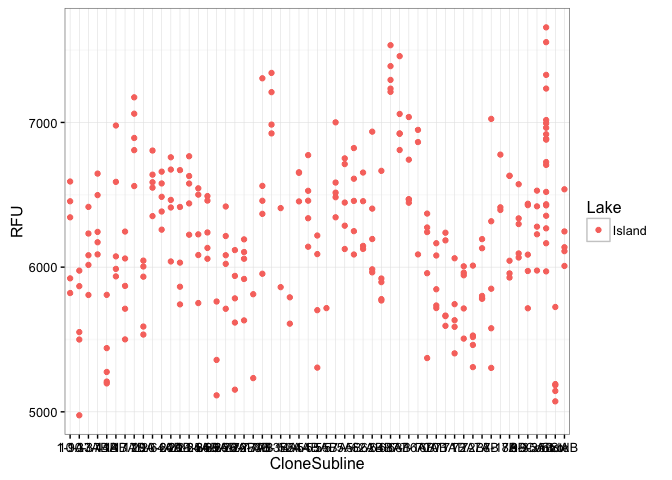
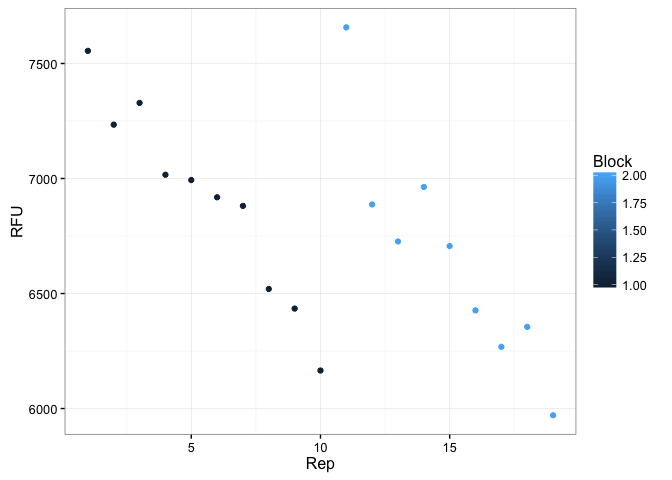
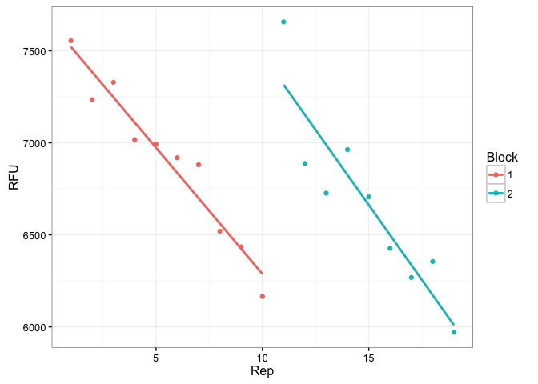

Indiana Feeding Rate Assays
================
Meghan Duffy
October 27, 2016

Does feeding rate differ before and after epidemics?
----------------------------------------------------

Data collection for this project led by Katie Hunsberger (technician in Duffy Lab), using clones sent from Spencer Hall's lab in Indiana. Data analysis led by Meghan Duffy (<duffymeg@umich.edu>)

Load libraries and data, do quick check of data
===============================================

    #> 'data.frame':    265 obs. of  8 variables:
    #>  $ Lake        : Factor w/ 1 level "Island": 1 1 1 1 1 1 1 1 1 1 ...
    #>  $ Block       : int  1 1 1 1 1 1 1 1 1 1 ...
    #>  $ CloneSubline: Factor w/ 55 levels "1-9A","10-37A",..: 53 22 22 22 22 22 1 1 1 1 ...
    #>  $ Rep         : int  1 1 2 3 4 5 1 2 3 4 ...
    #>  $ RFU         : num  7555 5954 6368 6459 6561 ...
    #>  $ length_um   : num  NA 1290 1258 1266 1253 ...
    #>  $ length_mm   : num  NA 1.29 1.26 1.27 1.25 ...
    #>  $ order       : int  1 2 3 4 5 6 7 8 9 10 ...

Right now, data sheet just has Island data in it. Will need to update this with rest of data, but starting with this as a trial.



Need to deal with drift in fluorometer data
-------------------------------------------

The fluorometer drifts over time. We quantify this by running controls periodically. We then need to factor out this drift to determine how the baseline RFUs for an ungrazed tube shifts over time.

First, let's look at what the data look like:

    #>  [1] 1 1 1 1 1 1 1 1 1 1 2 2 2 2 2 2 2 2 2
    #> Levels: 1 2



First attempt at correcting for drift
=====================================

Calculate regressions for different blocks

    #> 
    #> Call:
    #> lm(formula = RFU ~ order, data = controlblock1)
    #> 
    #> Residuals:
    #>     Min      1Q  Median      3Q     Max 
    #> -150.02  -78.40   13.43   67.58  180.45 
    #> 
    #> Coefficients:
    #>              Estimate Std. Error t value Pr(>|t|)    
    #> (Intercept) 7532.0034    64.3879  116.98 3.19e-14 ***
    #> order         -9.2394     0.8029  -11.51 2.95e-06 ***
    #> ---
    #> Signif. codes:  0 '***' 0.001 '**' 0.01 '*' 0.05 '.' 0.1 ' ' 1
    #> 
    #> Residual standard error: 108.3 on 8 degrees of freedom
    #> Multiple R-squared:  0.943,  Adjusted R-squared:  0.9359 
    #> F-statistic: 132.4 on 1 and 8 DF,  p-value: 2.949e-06

For block 1, predicted control RFU = 7532.0034-9.2394\*order

    #> 
    #> Call:
    #> lm(formula = RFU ~ order, data = controlblock2)
    #> 
    #> Residuals:
    #>     Min      1Q  Median      3Q     Max 
    #> -259.97  -77.23  -29.31  137.67  338.41 
    #> 
    #> Coefficients:
    #>             Estimate Std. Error t value Pr(>|t|)    
    #> (Intercept)  7329.39     132.51  55.310 1.66e-10 ***
    #> order         -10.72       1.80  -5.957 0.000566 ***
    #> ---
    #> Signif. codes:  0 '***' 0.001 '**' 0.01 '*' 0.05 '.' 0.1 ' ' 1
    #> 
    #> Residual standard error: 212.6 on 7 degrees of freedom
    #> Multiple R-squared:  0.8353, Adjusted R-squared:  0.8117 
    #> F-statistic: 35.49 on 1 and 7 DF,  p-value: 0.0005658

For block 2, predicted control RFU = 7329.39-10.72\*order

I could manually go in and try to create a new variable with those regressions, but I haven't figured that out yet. And surely there's a more elegant way to do this! I just haven't figured it out yet. (Eventually, the dataset will have many more blocks, and will include data for different lakes and time periods.) The basic thing I want to do is to split the data up by block (and, later when all the data are included, lake, time period, and block) and then have R create a new "predictedcontrolRFU" variable that uses the regression for each time block.

``` r
# modelled after examples by Jenny Bryan at
# http://stat545.com/block023_dplyr-do.html
lin_fit <- function(dat) {
  the_fit <- lm(RFU ~ order, dat)
  setNames(data.frame(t(coef(the_fit))), c("intercept", "slope"))
}

# test new function
lin_fit(controls %>% filter(Block == 1))
#>   intercept     slope
#> 1  7532.003 -9.239357

fits_df <- controls %>%
  group_by(Block) %>% 
  do(lin_fit(.))
fits_df
#> Source: local data frame [2 x 3]
#> Groups: Block [2]
#> 
#>   Block intercept      slope
#>   <int>     <dbl>      <dbl>
#> 1     1  7532.003  -9.239357
#> 2     2  7329.393 -10.721050

controls %>%
  left_join(fits_df) %>%
  mutate(predictedControlRFU = intercept - slope * order)
#> Joining, by = "Block"
#>      Lake Block CloneSubline Rep     RFU length_um length_mm order
#> 1  Island     1      Control   1 7554.90        NA        NA     1
#> 2  Island     1      Control   2 7234.15        NA        NA    16
#> 3  Island     1      Control   3 7328.65        NA        NA    31
#> 4  Island     1      Control   4 7016.45        NA        NA    46
#> 5  Island     1      Control   5 6993.27        NA        NA    60
#> 6  Island     1      Control   6 6918.45        NA        NA    75
#> 7  Island     1      Control   7 6880.91        NA        NA    90
#> 8  Island     1      Control   8 6519.91        NA        NA   105
#> 9  Island     1      Control   9 6434.52        NA        NA   120
#> 10 Island     1      Control  10 6165.30        NA        NA   135
#> 11 Island     2      Control  11 7657.08        NA        NA     1
#> 12 Island     2      Control  12 6887.31        NA        NA    17
#> 13 Island     2      Control  13 6726.35        NA        NA    32
#> 14 Island     2      Control  14 6963.17        NA        NA    47
#> 15 Island     2      Control  15 6706.36        NA        NA    62
#> 16 Island     2      Control  16 6426.64        NA        NA    77
#> 17 Island     2      Control  17 6268.23        NA        NA    92
#> 18 Island     2      Control  18 6354.94        NA        NA   108
#> 19 Island     2      Control  19 5970.67        NA        NA   124
#>    intercept      slope predictedControlRFU
#> 1   7532.003  -9.239357            7541.243
#> 2   7532.003  -9.239357            7679.833
#> 3   7532.003  -9.239357            7818.423
#> 4   7532.003  -9.239357            7957.014
#> 5   7532.003  -9.239357            8086.365
#> 6   7532.003  -9.239357            8224.955
#> 7   7532.003  -9.239357            8363.546
#> 8   7532.003  -9.239357            8502.136
#> 9   7532.003  -9.239357            8640.726
#> 10  7532.003  -9.239357            8779.317
#> 11  7329.393 -10.721050            7340.114
#> 12  7329.393 -10.721050            7511.651
#> 13  7329.393 -10.721050            7672.467
#> 14  7329.393 -10.721050            7833.282
#> 15  7329.393 -10.721050            7994.098
#> 16  7329.393 -10.721050            8154.914
#> 17  7329.393 -10.721050            8315.730
#> 18  7329.393 -10.721050            8487.267
#> 19  7329.393 -10.721050            8658.803
```

Jenny proposal
==============

Read data in.

``` r
df <- read.csv("indianafeedingrateassays_withcontrols.csv", na.strings = ".")
df$Block <- factor(df$Block)
head(df)
#>     Lake Block CloneSubline Rep     RFU length_um length_mm order
#> 1 Island     1      Control   1 7554.90        NA        NA     1
#> 2 Island     1           3B   1 5954.23   1290.44   1.29044     2
#> 3 Island     1           3B   2 6368.27   1258.19   1.25819     3
#> 4 Island     1           3B   3 6458.64   1266.39   1.26639     4
#> 5 Island     1           3B   4 6561.49   1253.18   1.25318     5
#> 6 Island     1           3B   5 7305.20   1234.70   1.23470     6
```

For the controls only, plot RFU against order and color by Block. Add a fitted line for each Block.

``` r
df %>%
  filter(CloneSubline == "Control") %>% 
  ggplot(aes(x = Rep, y = RFU, color = Block)) +
  geom_point() +
  geom_smooth(method = "lm", se = FALSE) +
  theme_bw() 
```



Regress RFU on order within Block, for the controls. Eyeball-o-metrically check the intercept and slope against the plot.

``` r
control_fit <- lm(RFU ~ Block/order - 1, data = df,
                  subset = CloneSubline == "Control")
summary(control_fit)
#> 
#> Call:
#> lm(formula = RFU ~ Block/order - 1, data = df, subset = CloneSubline == 
#>     "Control")
#> 
#> Residuals:
#>     Min      1Q  Median      3Q     Max 
#> -259.97  -83.89   11.24   81.23  338.41 
#> 
#> Coefficients:
#>              Estimate Std. Error t value Pr(>|t|)    
#> Block1       7532.003     98.293  76.628  < 2e-16 ***
#> Block2       7329.393    103.085  71.100  < 2e-16 ***
#> Block1:order   -9.239      1.226  -7.538 1.78e-06 ***
#> Block2:order  -10.721      1.400  -7.658 1.47e-06 ***
#> ---
#> Signif. codes:  0 '***' 0.001 '**' 0.01 '*' 0.05 '.' 0.1 ' ' 1
#> 
#> Residual standard error: 165.4 on 15 degrees of freedom
#> Multiple R-squared:  0.9995, Adjusted R-squared:  0.9994 
#> F-statistic:  8038 on 4 and 15 DF,  p-value: < 2.2e-16
```

Add a variable into `df` for the predicted RFU of a control tube (is this what you want? so you can subtract this from observed RFU?).

``` r
df$predictedControlRFU <-
  predict(control_fit, newdata = df[c("order", "Block")])
head(df)
#>     Lake Block CloneSubline Rep     RFU length_um length_mm order
#> 1 Island     1      Control   1 7554.90        NA        NA     1
#> 2 Island     1           3B   1 5954.23   1290.44   1.29044     2
#> 3 Island     1           3B   2 6368.27   1258.19   1.25819     3
#> 4 Island     1           3B   3 6458.64   1266.39   1.26639     4
#> 5 Island     1           3B   4 6561.49   1253.18   1.25318     5
#> 6 Island     1           3B   5 7305.20   1234.70   1.23470     6
#>   predictedControlRFU
#> 1            7522.764
#> 2            7513.525
#> 3            7504.285
#> 4            7495.046
#> 5            7485.807
#> 6            7476.567
```
